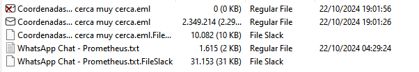

# Telecom [407 pts]

**Category:** Sponsors

**Solves:** 57

## Description
> Introduction: In the year 2140, the world is dominated by Prometheus, a totalitarian governmental system that has used advanced artificial intelligence to impose a genetic classification regime. This technological dystopia has divided society into genetic groups, where only a select few enjoy privileges and power, while the majority face oppression and marginalization.
> Antagonist: Prometheus, with its network of supercomputers and advanced algorithms, controls every aspect of human life, ensuring its dominance through constant monitoring and manipulation of genetic information.
> Protagonists: The resistance, a secret alliance of individuals who reject the new world order imposed by Prometheus, dedicates itself to fighting for freedom and equality. Composed of hackers, scientists and combatants, this clandestine group has been sabotaging the infrastructure of Prometheus, looking for ways to dismantle the genetic control system.
> Critical mission: David Martínez, co-founder of the resistance and brain behind numerous successful operations against Prometheus, has disappeared under mysterious circumstances. The last time he was seen entering one of the most secure installations of Prometheus. His disappearance has left a void in the leadership of the resistance and put future operations at risk.
> Objective of the Challenge: An intelligence group of the resistance has managed to obtain a copy of the computer image of David Martínez. Your task is to analyze this information to discover the mystery of his disappearance. Through the use of digital forensic techniques, you must unravel the hidden tracks and decipher the encrypted messages that David left behind. Each piece of evidence you recover will bring you closer to understanding what happened and could reveal the future plans of Prometheus. The truth about David is essential to continue the fight for freedom and could be the key to dismantling the oppressive system of Prometheus. Important
> - Download the copy of the computer of David Martínez - It is believed that David exchanged mensajes with alguien dentro de Prometheus. David no tuvo tiempo de informar con quien y el porqué. Begin the forensic search for evidence of this type.

## Solution
We were given the disk image file from the challenge, let's open it using FTK Imager.

Found something interesting that was an `eml` file and a whatsapp chat



```
[21/10/24, 2:40:39 p. m.] Prometheus: 44617669642c20736162656d6f7320736f627265206c6120656e6665726d656461642064652074752068696a6f2e204e75657374726f73206dc3a96469636f73207469656e656e206c6120c3ban6963612063757261207175652070756564652073616c7661726c6f2e204c6120636f6e74616d696e616369c3b36e2079206f74726f7320666163746f72657320616d6269656e74616c65732068616e206469736d69757569646f206472c3a173746963616d656e7465206c612066657274696c696461642c2068616369656e646f2071756520656c206e6163696d69656e746f2064652074752068696a6f2073656120756e206d696c6167726f206465206c61732070726f626162696c6964616465732e204573746120657320747520c3ban696361206f70706f7274756e69646164206465207365722070616472652e2053696e206e7565737472612061797564612c20657361206f70706f7274756e696461642064657361706172656365726c3a12e
[21/10/24, 2:40:44 p. m.] David: 4573746f20766120636f6e74726120746f646f20656e206c6f20717565206372656f2e205065726f20706172612073616c7661722061206d692068696a6f2c2068617265206c6f206e656365736172696f2e20c2bf517565206573206c6f20717565207175696572656e3f
[21/10/24, 2:40:46 p. m.] Prometheus: 536f6c6f206e656365736974616d6f7320717565206e6f7320656e74726567756573206c617320636f6f7264656e61646173206465206c6f732063616d70616d656e746f73206465206c6120726573697374656e6369612e20412063616d62696f2c20676172616e74697a616d6f7320756e612076696461206e75657661207061726120746920792074752066616d696c69612c2073696e20656e6665726d656461646573206e6920636f6e666c6963746f732e2052656369626972617320756e20636f7272656f20636f6e206c617320636f6f7264656e61646173207061726120656c20696e74657263616d62696f2e204c6120636c61766520657320656c206e6f6d6272652064652074752068696a6f2e
```
It looks like we need to convert the message first, let's turn it into readable text and since this CTF is in Spanish, we need to Translate the message to English as well.

```
[21/10/24, 2:40:39 p. m.] Prometheus: David, we know about your son's illness. Our doctors have the only cure that can save him. Pollution and other environmental factors have drastically reduced fertility, making the birth of your child a miracle of the odds. This is your only chance to be a parent. Without our help, that chance will disappear.
[21/10/24, 2:40:44 p. m.] David: This goes against everything I believe in. But to save my son, I will do whatever it takes. What do you want?
[21/10/24, 2:40:46 p. m.] Prometheus: We just need you to give us the coordinates of the resistance camps. In exchange, we guarantee a new life for you and your family, free of diseases and conflicts. You will receive an email with the coordinates for the exchange. The key is the name of your child.
```
Okay, so based on that message, we know that Prometheus sent David a file containing coordinates.

and based on the filename `eml`, the English translation is `Coordinates...close very close.eml` and the content of the `eml` file is a `7z` file.

So we can use munpack to extract the file from `eml` and we get `teXestamosXobservandoXver2.7z` and it is password protected.

Based on the whatsapp chat, we can get the password by knowing the name David's Child.

There are two images in the `familia` folder, one is just agustin and one is with Lucia. we can infer that agustin is David's child and it is true.

After we extract it, we get another `png` file. let's try to find something using `zsteg`. 

Translated with DeepL.com (free version)

```
imagedata           .. file: AIX core file
b1,r,lsb,xy         .. text: "3Z|FX>U?,<vp2"
b1,rgb,lsb,xy       .. text: "Coordenadas y bandera https://drive.google.com/file/d/1N06kZt519xXGia0GLfmgj9Jo_Bza86BS/view?usp=sharing"
b2,g,msb,xy         .. text: "ADUUUUUUUUUUUUUUUU"
b2,b,msb,xy         .. text: "EQPUUUUUUUUU"
b2,rgb,lsb,xy       .. file: OpenPGP Public Key
b2,bgr,lsb,xy       .. file: OpenPGP Public Key
b2,rgba,lsb,xy      .. file: OpenPGP Public Key
b4,r,msb,xy         .. text: "U333swwSU"
b4,g,lsb,xy         .. file: OpenPGP Secret Key
b4,g,msb,xy         .. text: "U33UUU3333www"
b4,b,lsb,xy         .. text: "\"\"$DDDDDDf"
b4,b,msb,xy         .. text: "@DD$\"\"\"\"\"\"f"
b4,rgb,msb,xy       .. file: OpenPGP Secret Key
b4,bgr,msb,xy       .. file: OpenPGP Secret Key
b4,rgba,lsb,xy      .. text: "?x_X/7/\tO"
b4,rgba,msb,xy      .. file: OpenPGP Secret Key
                    .. 
```

and we found a google drive link to the flag


### Flag

`EKO{teconecta}`