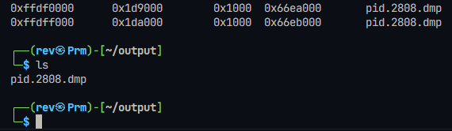
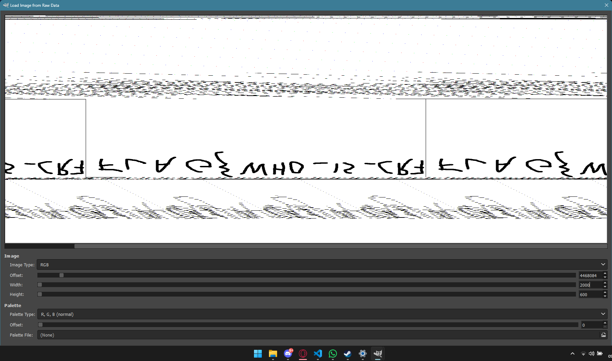
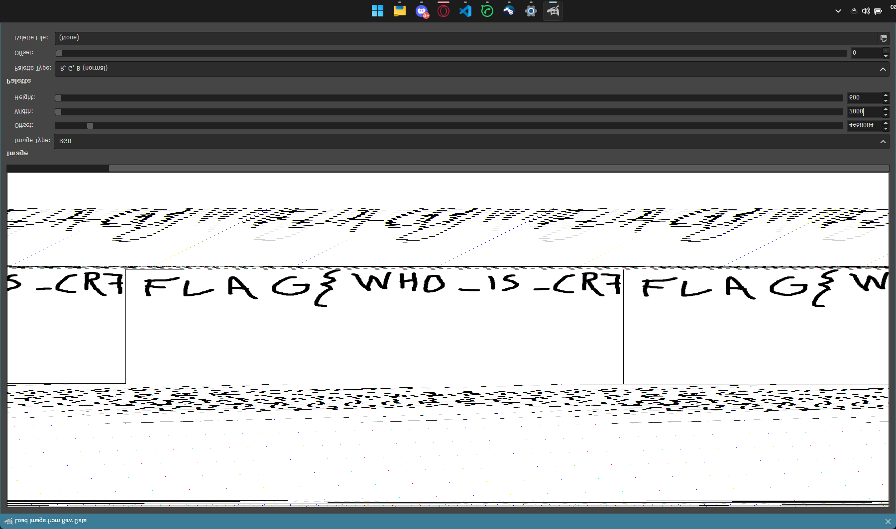

# Hamparte Artist [464 Pts]

**Category:** Forensics, stego

**Solves:** -

## Description
> Link: https://drive.google.com/file/d/1o7lGYM7MCpRpTWx7fhQM9yjSZurvuT_l/view?usp=sharing

## Solution
Let's see what os is used for this memory dump using volatility3

```
Variable        Value

Kernel Base     0x82804000
DTB     0x185000
Symbols file:///home/rev/volatility3/volatility3/symbols/windows/ntkrpamp.pdb/2F6693D273A446AA8740983BC3D539C2-2.json.xz
Is64Bit False
IsPAE   True
layer_name      0 WindowsIntelPAE
memory_layer    1 WindowsCrashDump32Layer
base_layer      2 FileLayer
KdDebuggerDataBlock     0x8292fc68
NTBuildLab      7601.18939.x86fre.win7sp1_gdr.15
CSDVersion      1
KdVersionBlock  0x8292fc40
Major/Minor     15.7601
MachineType     332
KeNumberProcessors      1
SystemTime      2021-10-28 13:13:25+00:00
NtSystemRoot    C:\Windows
NtProductType   NtProductWinNt
NtMajorVersion  6
NtMinorVersion  1
PE MajorOperatingSystemVersion  6
PE MinorOperatingSystemVersion  1
PE Machine      332
PE TimeDateStamp        Wed Jul 22 16:46:25 2015
```

We found somertthing interesting. It uses a 32-bit Windows 7 SP1 (Service Pack 1) system captured in October 2021, built for x86 architecture with PAE enabled.

Let's try analyze the process that is running.

```
PID     PPID    ImageFileName   Offset(V)       Threads Handles SessionId       Wow64   CreateTime      ExitTime      File output

2456    416     svchost.exe     0x38ea40        20      235     0       False   2021-10-28 13:11:04.000000 UTC  N/A   Disabled
2404    416     wmpnetwk.exe    0x13a9498       11      213     0       False   2021-10-28 13:11:04.000000 UTC  N/A   Disabled
2836    416     svchost.exe     0x1e818f0       8       106     0       False   2021-10-28 13:11:19.000000 UTC  N/A   Disabled
3344    416     svchost.exe     0x725bb08       16      368     0       False   2021-10-28 13:13:00.000000 UTC  N/A   Disabled
2204    416     SearchIndexer.  0x9a56a18       15      597     0       False   2021-10-28 13:11:04.000000 UTC  N/A   Disabled
316     1972    sshd.exe        0xa3ee030       4       99      0       False   2021-10-28 13:10:58.000000 UTC  N/A   Disabled
1920    1372    VBoxTray.exe    0xb1b2030       14      172     1       False   2021-10-28 13:10:58.000000 UTC  N/A   Disabled
100     288     conhost.exe     0xbbf5d28       2       33      0       False   2021-10-28 13:10:58.000000 UTC  N/A   Disabled
2808    1372    mspaint.exe     0xd0e8030       9       120     1       False   2021-10-28 13:11:19.000000 UTC  N/A   Disabled
1856    416     sppsvc.exe      0xee28218       4       145     0       False   2021-10-28 13:10:59.000000 UTC  N/A   Disabled
828     416     svchost.exe     0xee3f910       20      409     0       False   2021-10-28 13:10:57.000000 UTC  N/A   Disabled
856     416     svchost.exe     0xee4e030       42      1001    0       False   2021-10-28 13:10:57.000000 UTC  N/A   Disabled
956     416     svchost.exe     0xee614f0       32      442     0       False   2021-10-28 13:10:57.000000 UTC  N/A   Disabled
1048    416     svchost.exe     0xee7ea48       17      376     0       False   2021-10-28 13:10:57.000000 UTC  N/A   Disabled
1160    416     spoolsv.exe     0xeea3c30       13      274     0       False   2021-10-28 13:10:57.000000 UTC  N/A   Disabled
1200    416     svchost.exe     0xeec1030       22      332     0       False   2021-10-28 13:10:57.000000 UTC  N/A   Disabled
1284    416     taskhost.exe    0xeef14e8       10      168     1       False   2021-10-28 13:10:57.000000 UTC  N/A   Disabled
1344    828     dwm.exe 0xef089d0       4       69      1       False   2021-10-28 13:10:57.000000 UTC  N/A     Disabled
1372    1332    explorer.exe    0xef11b40       42      1061    1       False   2021-10-28 13:10:57.000000 UTC  N/A   Disabled
1456    416     vmicsvc.exe     0xef51030       8       104     0       False   2021-10-28 13:10:57.000000 UTC  N/A   Disabled
1548    416     vmicsvc.exe     0xef5e030       4       66      0       False   2021-10-28 13:10:57.000000 UTC  N/A   Disabled
1576    416     vmicsvc.exe     0xef63030       5       80      0       False   2021-10-28 13:10:57.000000 UTC  N/A   Disabled
1616    416     vmicsvc.exe     0xef6d6d8       5       81      0       False   2021-10-28 13:10:57.000000 UTC  N/A   Disabled
1648    416     svchost.exe     0xef75030       14      276     0       False   2021-10-28 13:10:57.000000 UTC  N/A   Disabled
1972    1752    cygrunsrv.exe   0xefd7d28       0       -       0       False   2021-10-28 13:10:58.000000 UTC  2021-10-28 13:10:58.000000 UTC Disabled
784     416     svchost.exe     0xefe2b00       5       91      0       False   2021-10-28 13:10:59.000000 UTC  N/A   Disabled
1812    416     wlms.exe        0xefe9510       4       45      0       False   2021-10-28 13:10:57.000000 UTC  N/A   Disabled
416     356     services.exe    0xf03a4f0       11      243     0       False   2021-10-28 17:10:55.000000 UTC  N/A   Disabled
432     356     lsass.exe       0xf04f030       8       583     0       False   2021-10-28 17:10:55.000000 UTC  N/A   Disabled
288     280     csrss.exe       0xf055700       9       480     0       False   2021-10-28 17:10:55.000000 UTC  N/A   Disabled
440     356     lsm.exe 0xf0591d8       10      142     0       False   2021-10-28 17:10:55.000000 UTC  N/A     Disabled
660     416     svchost.exe     0xf0c1200       8       252     0       False   2021-10-28 13:10:56.000000 UTC  N/A   Disabled
548     416     svchost.exe     0xf0d5c00       11      357     0       False   2021-10-28 17:10:55.000000 UTC  N/A   Disabled
608     416     VBoxService.ex  0xf0ea720       13      117     0       False   2021-10-28 17:10:56.000000 UTC  N/A   Disabled
716     416     svchost.exe     0xf10ed28       21      421     0       False   2021-10-28 13:10:57.000000 UTC  N/A   Disabled
1508    416     vmicsvc.exe     0xf11d298       6       106     0       False   2021-10-28 13:10:57.000000 UTC  N/A   Disabled
356     280     wininit.exe     0xf444030       3       76      0       False   2021-10-28 17:10:55.000000 UTC  N/A   Disabled
348     316     winlogon.exe    0xf449210       6       115     1       False   2021-10-28 17:10:55.000000 UTC  N/A   Disabled
220     4       smss.exe        0xf682848       2       29      N/A     False   2021-10-28 17:10:55.000000 UTC  N/A   Disabled
324     316     csrss.exe       0xfc73178       7       204     1       False   2021-10-28 17:10:55.000000 UTC  N/A   Disabled
1752    416     cygrunsrv.exe   0xfca8760       6       100     0       False   2021-10-28 13:10:57.000000 UTC  N/A   Disabled
4080    1372    notmyfault.exe  0xfd7a738       2       73      1       False   2021-10-28 13:13:17.000000 UTC  N/A   Disabled
4008    548     dllhost.exe     0xfd7ca40       0       -       1       False   2021-10-28 13:13:17.000000 UTC  2021-10-28 13:13:22.000000 UTC Disabled
4048    548     dllhost.exe     0xfda7708       0       -       0       False   2021-10-28 13:13:17.000000 UTC  2021-10-28 13:13:22.000000 UTC Disabled
3840    548     dllhost.exe     0xfdb23e8       0       -       1       False   2021-10-28 13:13:12.000000 UTC  2021-10-28 13:13:19.000000 UTC Disabled
4       0       System  0xffb4908       72      504     N/A     False   2021-10-28 17:10:55.000000 UTC  N/A     Disabled
```

Something is fishy. `mspaint.exe` is running on `PID` 2808. We know that Microsoft Paint is usually not run during windows machine startup.

Let's find some reference about memory analysis mspaint.

we found a [Similar Challenge](https://ctftime.org/writeup/23198) that looks the same as this challenge but there's no exact resolution of it.

let's try dump the memory and use GIMP and check any offset that can display a readable text.

`./vol.py -f ~/MEMORY.DMP -o ~/output windows.memmap.Memmap --pid 2808 --dump`

Output:





Flipped Version:



### Flag

`flag{WHO_IS_CR7}`