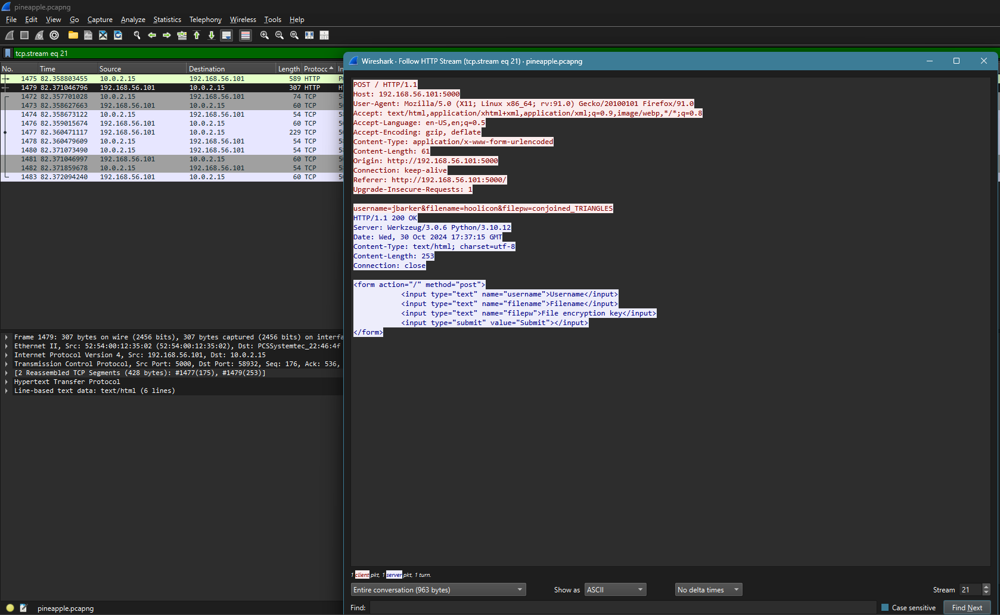
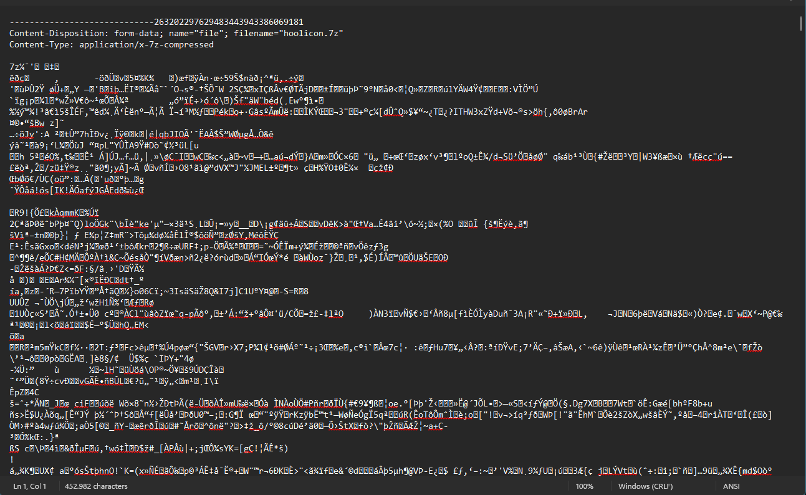

# pineapple

---

```
pineapple

300

Our covert pineapples intercepted this traffic from people at the convention. Try find out what was sent.

The flag for this challenge will appear in the CYBORG{} flag format.
ㅤ
author: neonlian
```
---

## Solution

Based on that description, we can try to figure out what is being sent by using the `stream` function in each protocol.



We found something useful in this stream, namely:

`username=jbarker&filename=hoolicon&filepw=conjoined_TRIANGLES`

Apparently, there is a file called hoolicon somewhere inside this `pcapng` file.

We can try to dump all the media/files that are inside this `pcapng` file.

After dumping all the files, We found the file we're looking for in the name of `plans (1)`.



Change the file extenstion to `.7z`

Extract the zip with `conjoined_TRIANGLES` as the password, and you got the flag

---

flag: `CYBORG{pe4cefaRe_4x09}`