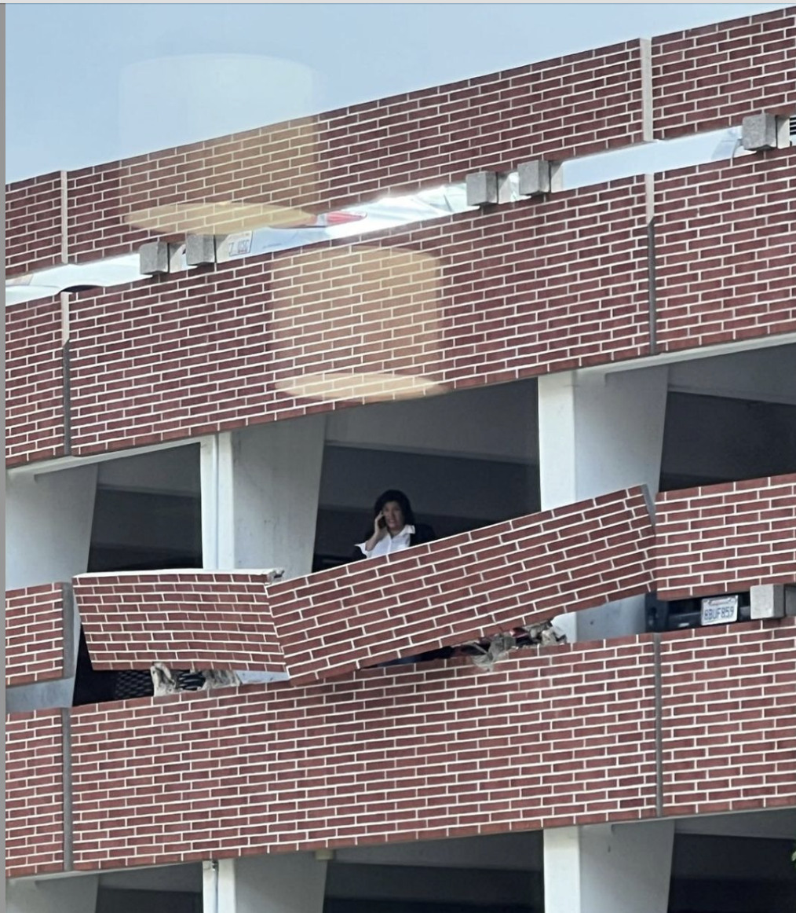
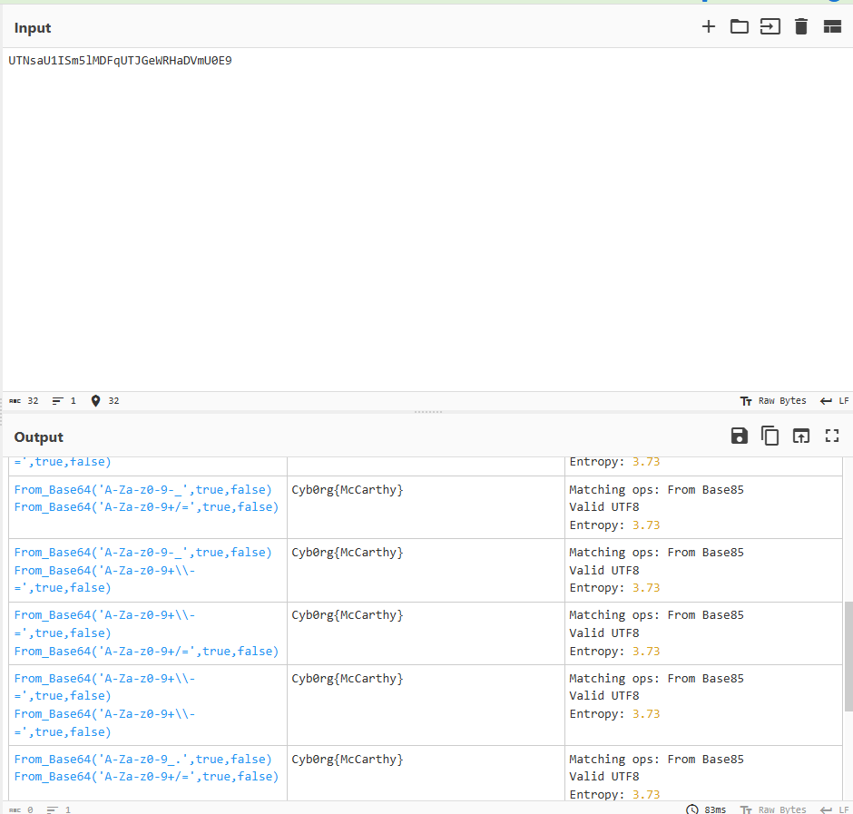

# think_twice

```
think_twice

300

Think twice before you drive to the EXIT(F)!!!
ㅤ
Note: the flag format for this challenge is Cyb0rg{}, with a zero as the 0
ㅤ
author: nguyen-huong
```
Image:


Solution:
Based on the title of the image file, we can try to check the image metadata by using `exiftool`


```
┌──(rev㉿Prm)-[/mnt/c/Users/Indop/OneDrive/Documents/CTF/USC/2024/foren/think_twice]
└─$ exiftool metadata.png
ExifTool Version Number         : 12.76
File Name                       : metadata.png
Directory                       : .
File Size                       : 400 kB
File Modification Date/Time     : 2024:11:03 16:04:46+07:00
File Access Date/Time           : 2024:11:03 16:41:57+07:00
File Inode Change Date/Time     : 2024:11:03 16:05:59+07:00
File Permissions                : -rwxrwxrwx
File Type                       : JPEG
File Type Extension             : jpg
MIME Type                       : image/jpeg
Exif Byte Order                 : Big-endian (Motorola, MM)
Orientation                     : Horizontal (normal)
X Resolution                    : 144
Y Resolution                    : 144
Resolution Unit                 : inches
Software                        : UTNsaU1ISm5lMDFqUTJGeWRHaDVmU0E9
User Comment                    : Screenshot
Exif Image Width                : 1014
Exif Image Height               : 1162
Profile CMM Type                : Apple Computer Inc.
Profile Version                 : 2.1.0
Profile Class                   : Display Device Profile
Color Space Data                : RGB
Profile Connection Space        : XYZ
Profile Date Time               : 2024:03:29 00:41:41
Profile File Signature          : acsp
Primary Platform                : Apple Computer Inc.
CMM Flags                       : Not Embedded, Independent
Device Manufacturer             : Apple Computer Inc.
Device Model                    :
Device Attributes               : Reflective, Glossy, Positive, Color
Rendering Intent                : Perceptual
Connection Space Illuminant     : 0.9642 1 0.82491
Profile Creator                 : Apple Computer Inc.
Profile ID                      : 0
Profile Description             : Display
Profile Description ML (hr-HR)  : LCD u boji
Profile Description ML (ko-KR)  : 컬러 LCD
Profile Description ML (nb-NO)  : Farge-LCD
Profile Description ML (hu-HU)  : Színes LCD
Profile Description ML (cs-CZ)  : Barevný LCD
Profile Description ML (da-DK)  : LCD-farveskærm
Profile Description ML (nl-NL)  : Kleuren-LCD
Profile Description ML (fi-FI)  : Väri-LCD
Profile Description ML (it-IT)  : LCD a colori
Profile Description ML (es-ES)  : LCD a color
Profile Description ML (ro-RO)  : LCD color
Profile Description ML (fr-CA)  : ACL couleur
Profile Description ML (uk-UA)  : Кольоровий LCD
Profile Description ML (he-IL)  : ‏LCD צבעוני
Profile Description ML (zh-TW)  : 彩色LCD
Profile Description ML (vi-VN)  : LCD Màu
Profile Description ML (sk-SK)  : Farebný LCD
Profile Description ML (zh-CN)  : 彩色LCD
Profile Description ML (ru-RU)  : Цветной ЖК-дисплей
Profile Description ML (en-GB)  : Colour LCD
Profile Description ML (fr-FR)  : LCD couleur
Profile Description ML (hi-IN)  : रंगीन LCD
Profile Description ML (th-TH)  : LCD สี
Profile Description ML (ca-ES)  : LCD en color
Profile Description ML (en-AU)  : Colour LCD
Profile Description ML (es-XL)  : LCD color
Profile Description ML (de-DE)  : Farb-LCD
Profile Description ML          : Color LCD
Profile Description ML (pt-BR)  : LCD Colorido
Profile Description ML (pl-PL)  : Kolor LCD
Profile Description ML (el-GR)  : Έγχρωμη οθόνη LCD
Profile Description ML (sv-SE)  : Färg-LCD
Profile Description ML (tr-TR)  : Renkli LCD
Profile Description ML (pt-PT)  : LCD a cores
Profile Description ML (ja-JP)  : カラーLCD
Profile Copyright               : Copyright Apple Inc., 2024
Media White Point               : 0.95045 1 1.08905
Red Matrix Column               : 0.51512 0.2412 -0.00105
Green Matrix Column             : 0.29198 0.69225 0.04189
Blue Matrix Column              : 0.1571 0.06657 0.78407
Red Tone Reproduction Curve     : (Binary data 2060 bytes, use -b option to extract)
Video Card Gamma                : (Binary data 48 bytes, use -b option to extract)
Native Display Info             : (Binary data 62 bytes, use -b option to extract)
Make And Model                  : (Binary data 40 bytes, use -b option to extract)
Blue Tone Reproduction Curve    : (Binary data 2060 bytes, use -b option to extract)
Green Tone Reproduction Curve   : (Binary data 2060 bytes, use -b option to extract)
XMP Toolkit                     : Image::ExifTool 12.40
Image Width                     : 1014
Image Height                    : 1162
Encoding Process                : Baseline DCT, Huffman coding
Bits Per Sample                 : 8
Color Components                : 3
Y Cb Cr Sub Sampling            : YCbCr4:4:4 (1 1)
Image Size                      : 1014x1162
Megapixels                      : 1.2
```
Found something interesting in the `Software` value which is `UTNsaU1ISm5lMDFqUTJGeWRHaDVmU0E9`. We can try to decrypt it using CyberChef



Flag: `Cyb0rg{McCarthy}`