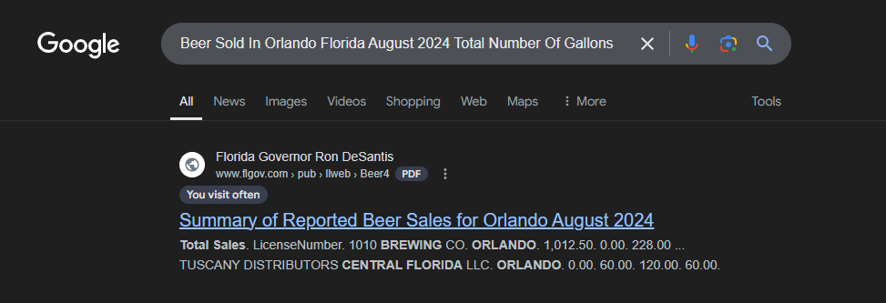
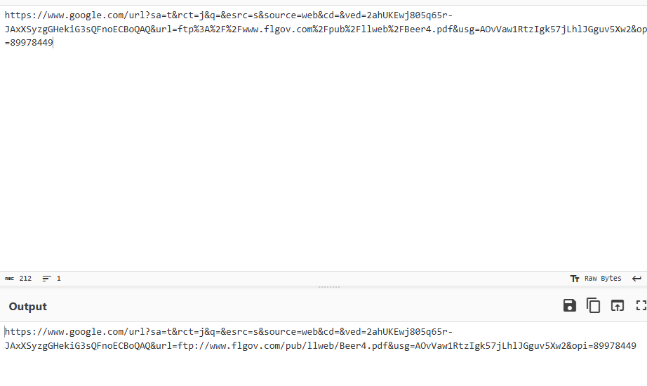

# beer sales

```
beer sales

300

In August 2024, a lot of beer was sold in Orlando, Florida. But how much, exactly? Lucky for us, they left the exact number on a PDF on an open FTP server! Include the total number of gallons of beer.

ㅤ
For example: CYBORG{712931.12}

ㅤ
UPDATE: Due to the FTP server going down, you may submit the URL of the PDF as the flag.

ㅤ
For example: CYBORG{example.com/dir/report.pdf}

ㅤ
author: moonlight
```

Because I solved this after the ftp is down, so the flag format will be the url of the pdf



Because the link is URL Encoded format, we need to decode it first



the link is: 
`www.flgov.com/pub/llweb/Beer4.pdf`

flag: `CYBORG{www.flgov.com/pub/llweb/Beer4.pdf}`